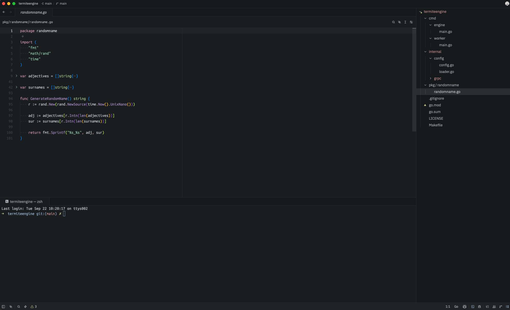
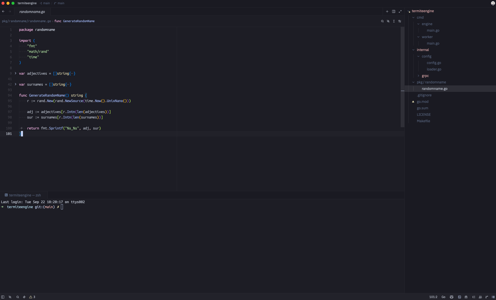
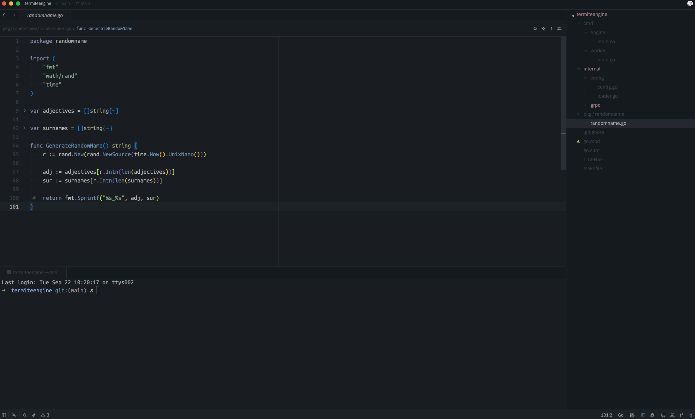
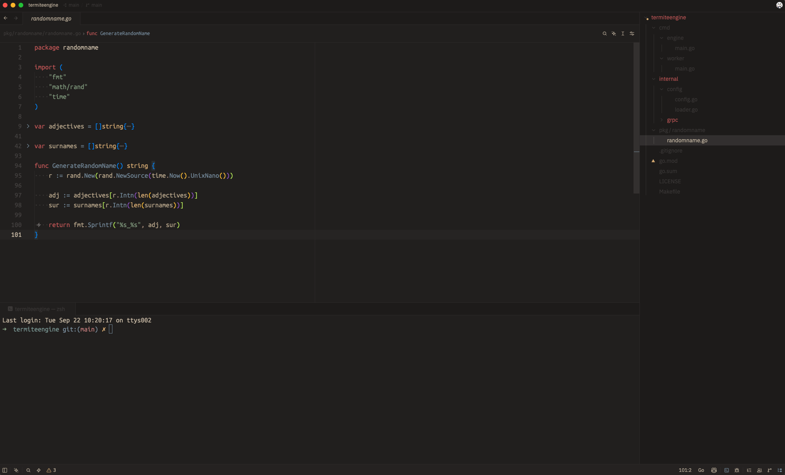
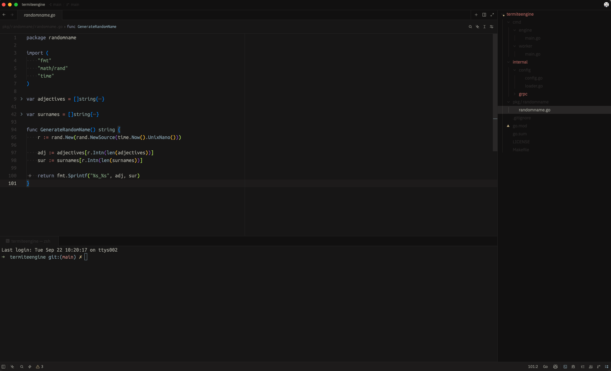
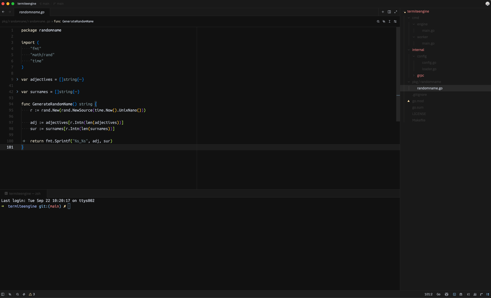
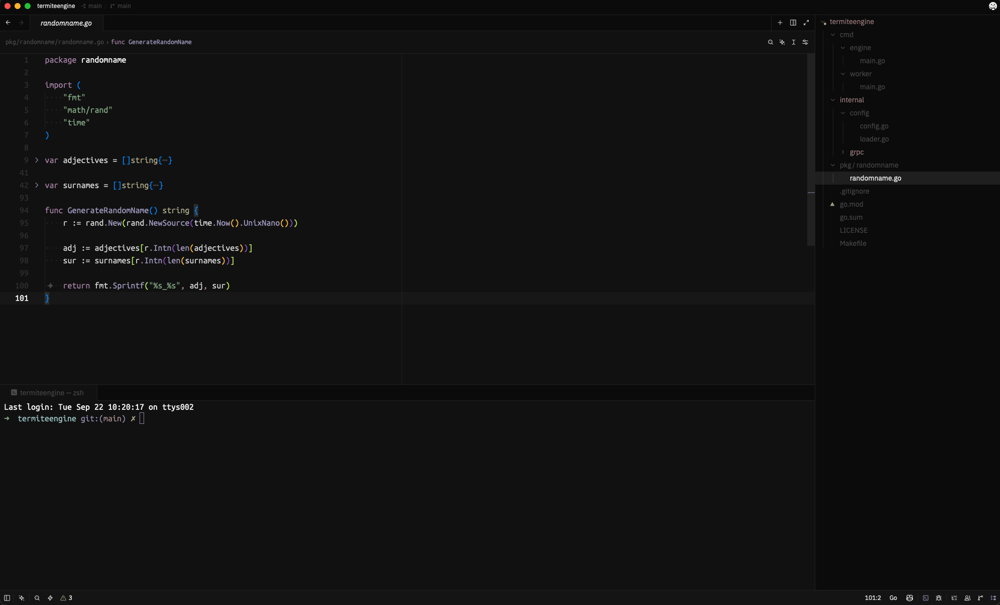
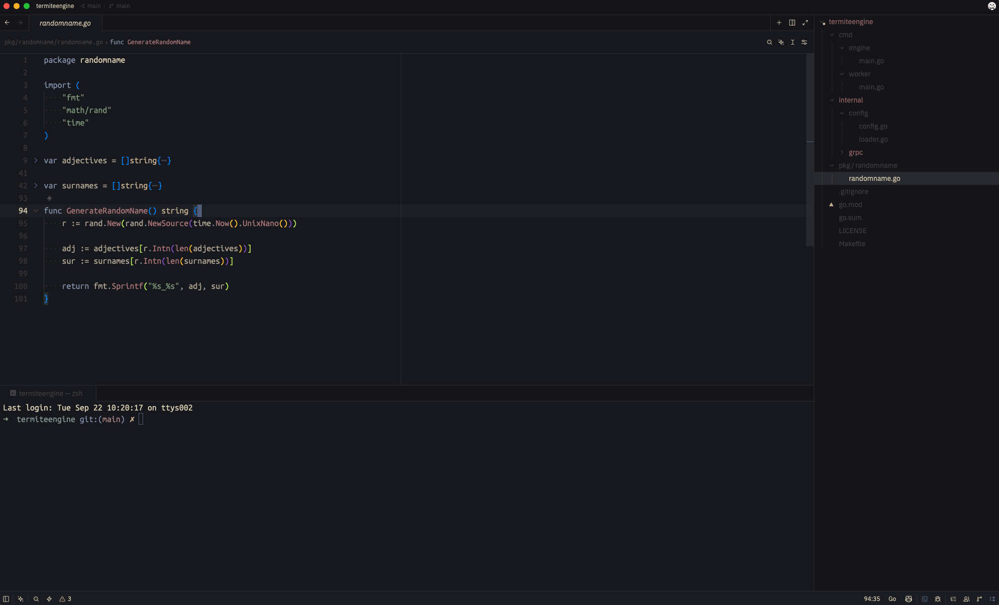

<div align="center">

# NvChad Themes for Zed

A collection of [NvChad](https://nvchad.com) themes ported to [Zed](https://zed.dev), generated directly from the official [base46](https://github.com/NvChad/base46) palettes.

[](LICENSE)
[](https://zed.dev/extensions)


</div>

## Themes

All themes are dark. Each one keeps NvChad's syntax mapping, including the theme-specific highlight tweaks (`polish_hl`) from base46.

### NvChad Ashes



### NvChad Aquarium



### NvChad Chadtain



### NvChad Chocolate



### NvChad Kanagawa Dragon



### NvChad Monochrome



### NvChad Mountain



### NvChad Nightlamp



## Installation

### From the Zed extensions registry

1. Open Zed and run `zed: extensions` from the command palette (<kbd>Cmd</kbd>/<kbd>Ctrl</kbd> + <kbd>Shift</kbd> + <kbd>X</kbd>).
2. Search for **NvChad Themes** and click **Install**.
3. Run `theme selector: toggle` (<kbd>Cmd</kbd>/<kbd>Ctrl</kbd> + <kbd>K</kbd>, <kbd>Cmd</kbd>/<kbd>Ctrl</kbd> + <kbd>T</kbd>) and pick any **NvChad** theme.

### Manually

```sh
git clone https://github.com/aminbista66/nvchad-themes.git
mkdir -p ~/.config/zed/themes
cp nvchad-themes/themes/*.json ~/.config/zed/themes/
```

Then select a theme from the theme selector.

### Via settings

```json
{
  "theme": {
    "mode": "dark",
    "dark": "NvChad Kanagawa Dragon"
  }
}
```

## Building

The theme files in `themes/` are generated. `build.py` downloads each palette from base46 and maps it onto Zed's theme schema:

```sh
python3 build.py
```

To add another NvChad theme, add its base46 file name (for example `"onedark"`) to `THEMES` in `build.py` and rerun. The script uses only the Python standard library.

## Contributing

Issues and pull requests are welcome. To test changes locally, run `zed: install dev extension` from the command palette and point it at this repository.

## Credits

This project is a port. All credit for the colors goes to the original authors:

- **[NvChad](https://github.com/NvChad/NvChad)** and the **[base46](https://github.com/NvChad/base46)** contributors, for creating and maintaining every theme in this collection.
- The upstream schemes some of the base46 themes are based on:
  - [Ashes](https://github.com/NvChad/base46/blob/v3.0/lua/base46/themes/ashes.lua): [Base16 Ashes](https://github.com/chriskempson/base16-vim) by Jannik Siebert
  - [Aquarium](https://github.com/NvChad/base46/blob/v3.0/lua/base46/themes/aquarium.lua): [aquarium-vim](https://github.com/FrenzyExists/aquarium-vim) by FrenzyExists
  - [Chocolate](https://github.com/NvChad/base46/blob/v3.0/lua/base46/themes/chocolate.lua): [chocolate](https://gitlab.com/snakedye/chocolate) by snakedye
  - [Kanagawa Dragon](https://github.com/NvChad/base46/blob/v3.0/lua/base46/themes/kanagawa-dragon.lua): [kanagawa.nvim](https://github.com/rebelot/kanagawa.nvim) by rebelot
  - [Monochrome](https://github.com/NvChad/base46/blob/v3.0/lua/base46/themes/monochrome.lua): [monochrome.nvim](https://github.com/kdheepak/monochrome.nvim) by kdheepak
  - [Mountain](https://github.com/NvChad/base46/blob/v3.0/lua/base46/themes/mountain.lua): [Mountain](https://github.com/mountain-theme/Mountain)
  - [Chadtain](https://github.com/NvChad/base46/blob/v3.0/lua/base46/themes/chadtain.lua) and [Nightlamp](https://github.com/NvChad/base46/blob/v3.0/lua/base46/themes/nightlamp.lua): base46 lists no upstream source
- **[Zed](https://zed.dev)**, for the theme and extension API.

This is an unofficial port and isn't affiliated with the NvChad project.

## License

[MIT](LICENSE)
